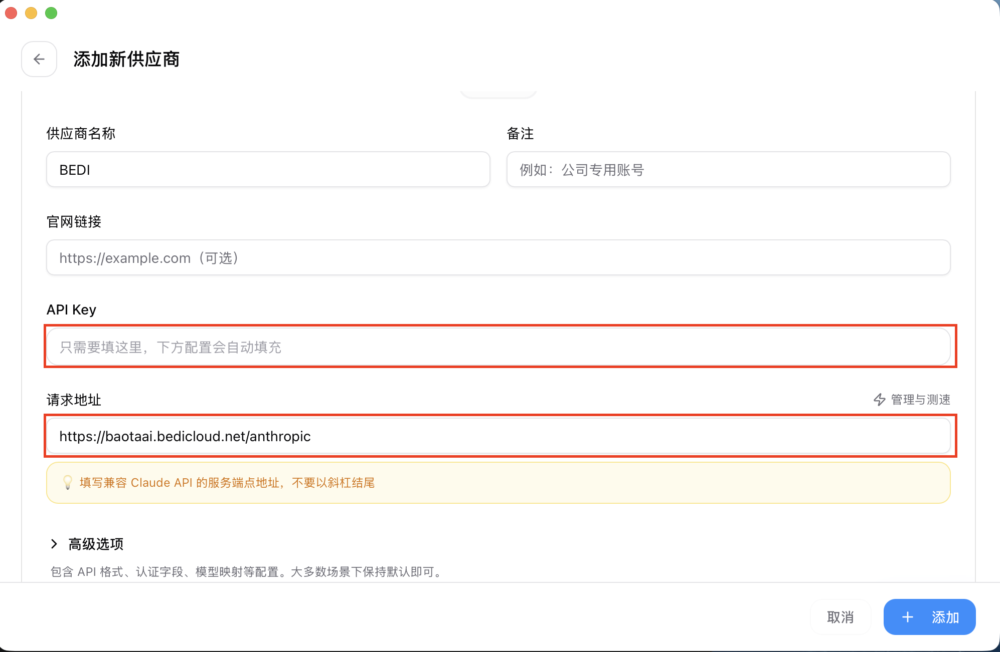
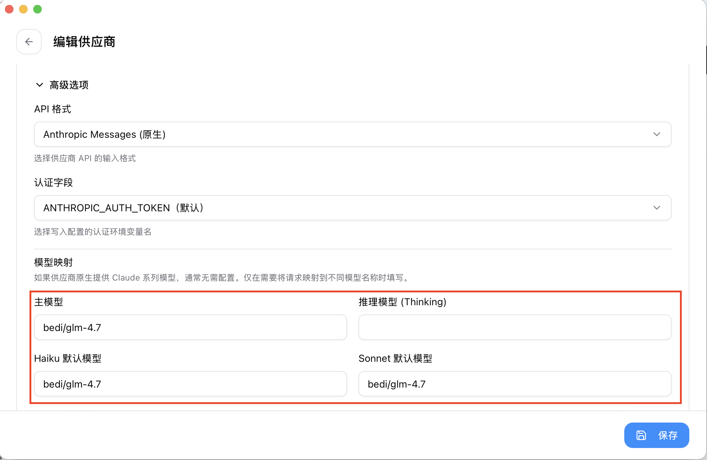
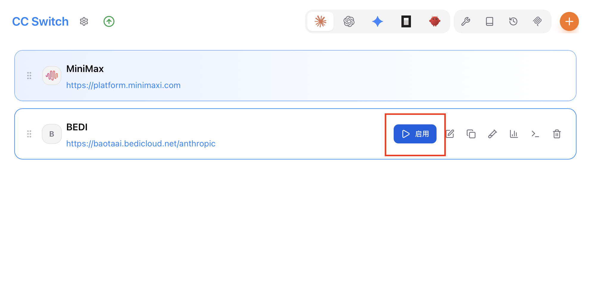
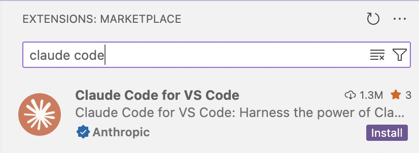
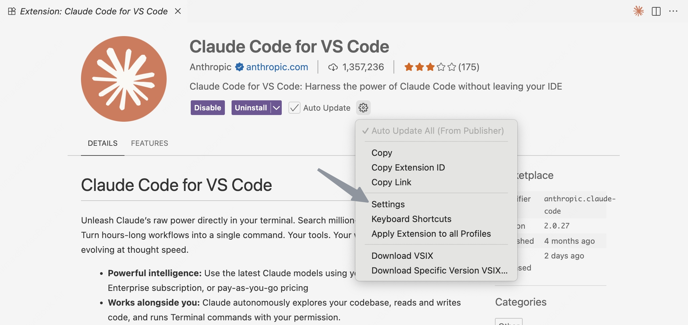
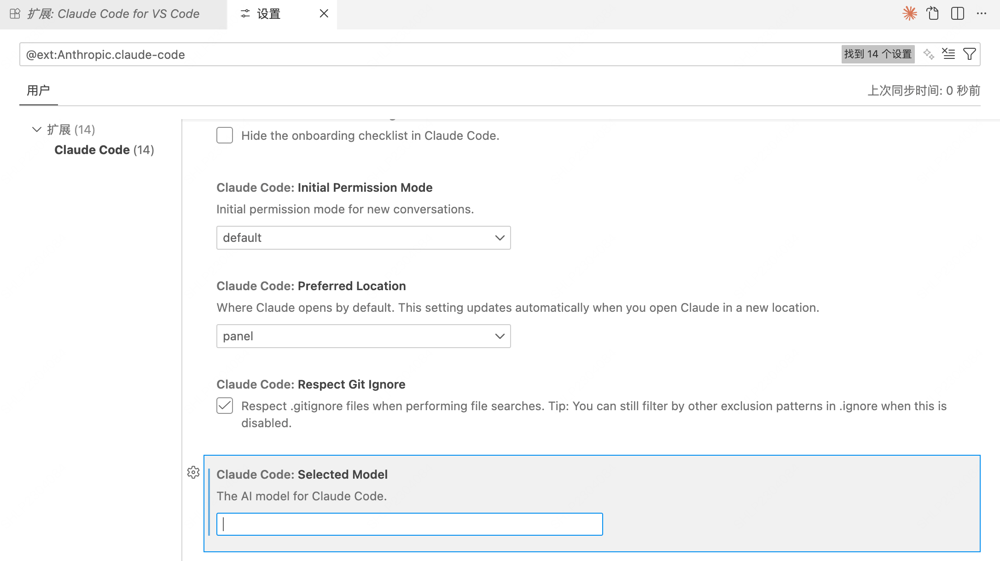
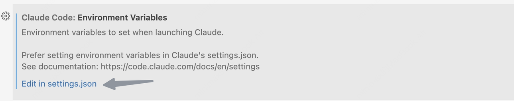

# Claude Code 接入

在 Claude Code 中使用 BEDI 的 Anthropic 兼容网关（`/anthropic/v1/messages`）进行 AI 编程。

## 前提条件

- 已安装 Node.js 18+
- 已安装 Claude Code CLI（`@anthropic-ai/claude-code`）
- 已获取 BEDI API Key

安装 Claude Code（如未安装）：

```bash
npm install -g @anthropic-ai/claude-code
```

## 配置前清理（重要）

如果你之前配置过其他 Anthropic 代理，建议先清理旧变量，避免优先级覆盖导致配置不生效。

```bash
unset ANTHROPIC_AUTH_TOKEN
unset ANTHROPIC_BASE_URL
unset ANTHROPIC_API_KEY
unset ANTHROPIC_API_BASE
```

如果这些变量在 `~/.zshrc` / `~/.bashrc` 中被永久导出，请同步删除对应行后重新打开终端。

## API 配置

你可以在 `cc-switch` 与手写配置之间随时切换。  
建议先确定一个主方案，另一个作为备用方案保留。

<!-- tabs:start -->

#### **使用 cc-switch（推荐）**

`cc-switch` 适合多供应商切换场景，配置更直观。

**1. 安装 cc-switch**

<!-- tabs:start -->
#### **macOS / Linux**

```bash
brew tap farion1231/ccswitch
brew install --cask cc-switch
brew upgrade --cask cc-switch
```

#### **Windows**

前往 `cc-switch` 的 GitHub Releases 页面下载最新版安装包。
<!-- tabs:end -->

**2. 添加 BEDI 配置**

在 cc-switch 中新增一条配置，按下列信息填写：

- Provider/Type：自定义配置(Custom)
- Base URL：`https://baotaai.bedicloud.net/anthropic`
- API Key：你的 BEDI API Key
- 默认模型：建议 `bedi/glm-4.7`（也可替换为你有权限的其他模型）
- Haiku/Sonnet/Opus 映射模型：全部填同一个可用模型（建议同上）

说明：Claude Code 会在 Base URL 后拼接 `/v1/messages`，因此 Base URL 只需填到 `/anthropic`。




**3. 启用配置**

返回 cc-switch 首页，点击启用当前配置。



**4. 设置 onboarding 标记**

编辑或新增 `~/.claude.json`（Windows 为用户目录下 `.claude.json`）：

```json
{
  "hasCompletedOnboarding": true
}
```

#### **手动编辑配置文件**

编辑或创建 `~/.claude/settings.json`（Windows 为用户目录下 `.claude/settings.json`）：

```json
{
  "env": {
    "ANTHROPIC_BASE_URL": "https://baotaai.bedicloud.net/anthropic",
    "ANTHROPIC_AUTH_TOKEN": "YOUR_BEDI_API_KEY",
    "API_TIMEOUT_MS": "3000000",
    "CLAUDE_CODE_DISABLE_NONESSENTIAL_TRAFFIC": "1",
    "ANTHROPIC_MODEL": "bedi/glm-4.7",
    "ANTHROPIC_DEFAULT_HAIKU_MODEL": "bedi/glm-4.7",
    "ANTHROPIC_DEFAULT_SONNET_MODEL": "bedi/glm-4.7",
    "ANTHROPIC_DEFAULT_OPUS_MODEL": "bedi/glm-4.7",
    "CLAUDE_CODE_SUBAGENT_MODEL": "bedi/glm-4.7"
  }
}
```

再编辑或新增 `~/.claude.json`：

```json
{
  "hasCompletedOnboarding": true
}
```

注意：

- `ANTHROPIC_AUTH_TOKEN` / `ANTHROPIC_BASE_URL` 的环境变量优先级通常高于配置文件中的其他字段。
- 若你同时设置了旧变量（如 `ANTHROPIC_API_KEY`），建议统一清理，避免冲突。

<!-- tabs:end -->

### 方案切换建议

- 从 `cc-switch` 切到 `手动编辑配置文件`：关闭 cc-switch 当前激活配置，保留 `~/.claude/settings.json` 生效。
- 从 `手动编辑配置文件` 切到 `cc-switch`：清理 shell 中手工导出的旧变量，启用 cc-switch 对应配置。
- 每次切换后，建议重开终端并执行一次 `/status` 与 `/model` 校验。

## 启动与验证

### 1. 启动 Claude Code

进入项目目录后执行：

```bash
claude
```

首次进入请选 `Trust This Folder`，允许 Claude Code 访问当前目录文件。

### 2. 验证配置生效

在 Claude Code TUI 中执行：

```text
/status
/model
```

期望结果：

- `/status` 中 `ANTHROPIC_BASE_URL` 指向 `https://baotaai.bedicloud.net/anthropic`
- `/model` 显示当前模型为你配置的 BEDI 模型（例如 `bedi/glm-4.7`）

## 支持能力

通过 BEDI Anthropic 兼容接口，Claude Code 可使用以下能力：

| 功能 | 状态 | 说明 |
|------|------|------|
| 非流式对话 | ✅ | 标准 JSON 响应 |
| 流式对话（SSE） | ✅ | Anthropic 事件流格式 |
| 工具调用（Tools） | ✅ | `tool_use` / `tool_result` |
| 流式工具调用 | ✅ | `input_json_delta` |
| Token 计数 | ✅ | `/anthropic/v1/messages/count_tokens` |
| `system` 数组格式 | ✅ | `system: [{type:"text", text:"..."}]` |
| `content` 块格式 | ✅ | `content: [{type:"text", text:"..."}]` |

## 在 Claude Code for VS Code 插件中使用

### 1. 安装插件

在 VS Code 扩展市场安装 Claude Code 插件。



### 2. 打开插件设置

安装后进入插件设置页。



### 3. 配置模型

在设置中将模型配置为你的 BEDI 模型（例如 `bedi/glm-4.7`）。

- 路径示例：`Claude Code: Selected Model`
- 或在 `settings.json` 中设置：`claudeCode.selectedModel`

示例：

```json
{
  "claudeCode.selectedModel": "bedi/glm-4.7"
}
```



### 4. 配置环境变量

在 VS Code 的 `settings.json` 中设置 `claudeCode.environmentVariables`：

```json
{
  "claudeCode.environmentVariables": [
    {
      "name": "ANTHROPIC_BASE_URL",
      "value": "https://baotaai.bedicloud.net/anthropic"
    },
    {
      "name": "ANTHROPIC_AUTH_TOKEN",
      "value": "YOUR_BEDI_API_KEY"
    },
    {
      "name": "API_TIMEOUT_MS",
      "value": "3000000"
    },
    {
      "name": "CLAUDE_CODE_DISABLE_NONESSENTIAL_TRAFFIC",
      "value": "1"
    },
    {
      "name": "ANTHROPIC_MODEL",
      "value": "bedi/glm-4.7"
    },
    {
      "name": "ANTHROPIC_DEFAULT_SONNET_MODEL",
      "value": "bedi/glm-4.7"
    },
    {
      "name": "ANTHROPIC_DEFAULT_OPUS_MODEL",
      "value": "bedi/glm-4.7"
    },
    {
      "name": "ANTHROPIC_DEFAULT_HAIKU_MODEL",
      "value": "bedi/glm-4.7"
    }
  ]
}
```



